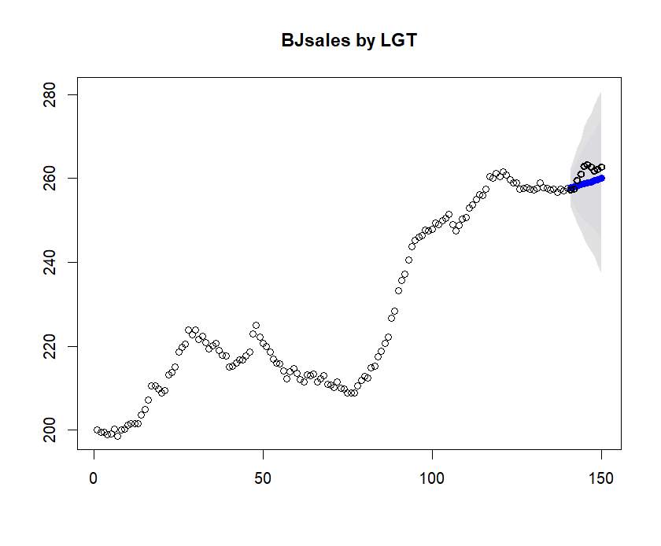
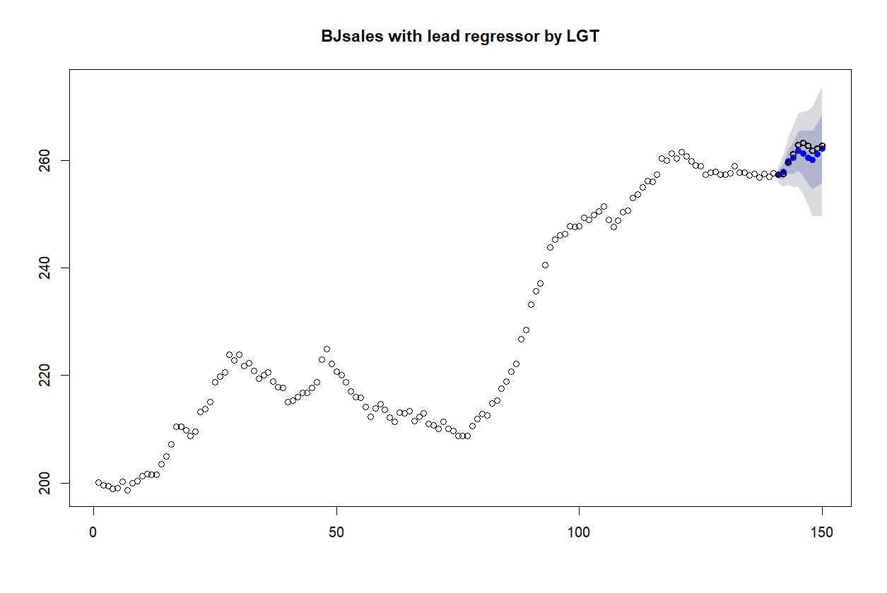
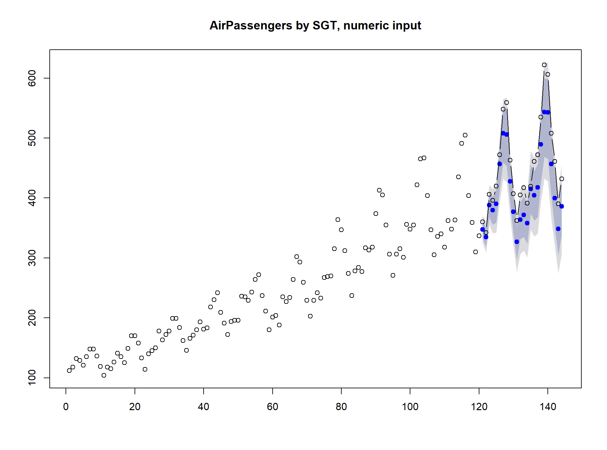
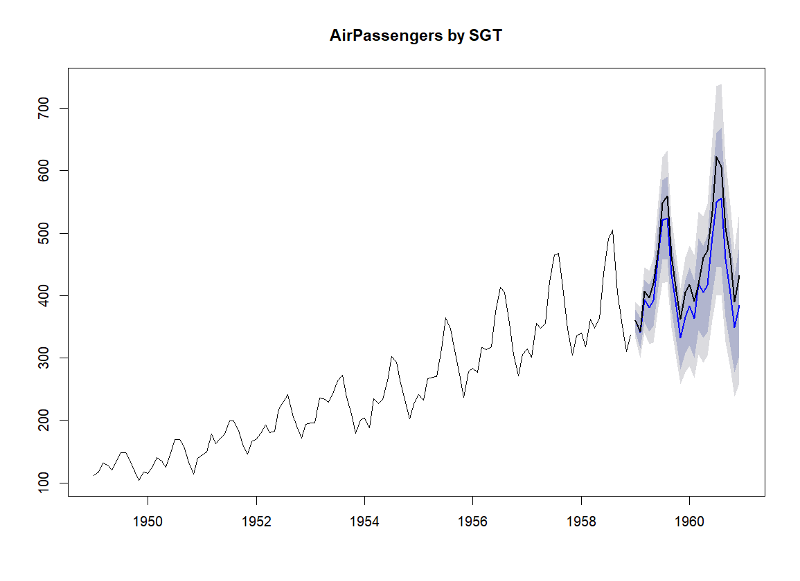
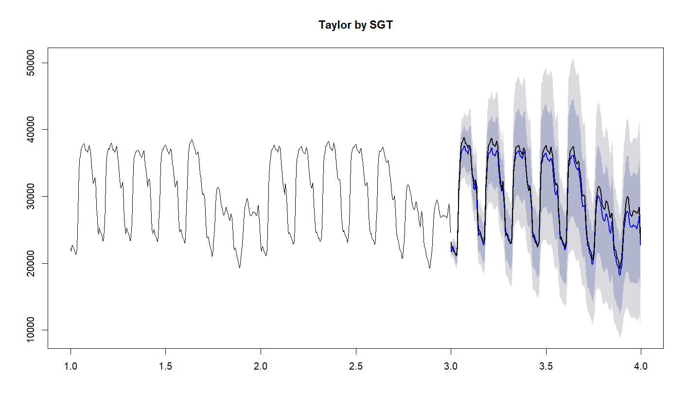

```{r setup, include = FALSE}
knitr::opts_chunk$set(
  collapse = TRUE,
  comment = "#>"
)
```


## Introduction  
This vignette provides a practical introduction to Global Trend (GT) time series forecasting models. For a deeper understanding of the models please consult the GT_models vignette.

The models can be seen as extensions of following Exponential Smoothing models: Holt Linear Method (LGT), Holt-Winters model (SGT), and Taylor dual seasonality model (S2GT). The main differences are as follows:

* nonlinear global trend, that spans damped, linear, to exponential trends.
* Student-t distribution of error
* function for the error size, so the model is heteroscedastic
* possibility to add regression components.

The nonlinear global trend allows to model well a frequent situation in business where series grow faster than linearly, but slower than exponentially. The global trend can also fit a damped trend.
The models are Bayesian and perform well on short time series, e.g. providing decent 18 months ahead forecasts based just on 13 months of data (seasonality+1 of data point are needed).

The models are fitted using Markov Chain Monte Carlo with the RStan package. One of the consequences is that their computational requirements are 2-3 orders of magnitude higher in comparison to e.g. ETS from the Forecast package. So, while these models are often more precise than the classical time series algorithms, they are not suitable for quick forecasting on a large number of time series.

The current version of the models supports time series data with positive data values only. Many time series data fall into this category, while for others, a simple transformation can be performed to obtain the required positive time-series data.

 
 
## LGT (Local and Global Trend)

It generalizes the Holt Linear method, so it is meant to be used on non-seasonal series, like yearly series. It has two trends: local linear trend and global nonlinear trend. Together, these trends can model well situations of short local trends that may go against the long trend, but eventually will be overridden by the latter.

### Fitting

For example, let's forecast the last 10 points from the "BJsales" dataset:

```
library(Rlgt)
options(width=140)

theDataSet=BJsales
horizon=10
train=theDataSet[1:(length(theDataSet)-horizon)]
actuals=theDataSet[(length(theDataSet)+1-horizon):length(theDataSet)]

model = rlgt(train) 
```
All models of the package are fitted using the rlgt() function. As a minimum, like in this example, we need to pass the time series. 
NUM_OF_ITER of steps (by default `r Rlgt::rlgt.control()$NUM_OF_ITER`) are executed, half warmup and half sampling, and then a simple check of the fit quality is done: average Rhat (over all parameters) is compared to MAX_RHAT_ALLOWED (by default `r Rlgt::rlgt.control()$MAX_RHAT_ALLOWED`). If this average is larger than MAX_RHAT_ALLOWED and MAX_NUM_OF_REPEATS is larger than 1 (by default it is `r Rlgt::rlgt.control()$MAX_NUM_OF_REPEATS`), then the number of iterations is doubled and the fitting repeated. When this happens you will see a message like below:
   
[1] "avgRHat 1.00642365671319"   
[1] "trying to do better..."

A model with average Rhat a bit larger than the default MAX_RHAT_ALLOWED is still likely to provide a good forecast - the default MAX_RHAT_ALLOWED is quite conservative. So when the execution time is limited, you can set MAX_NUM_OF_REPEATS to 1, or increase MAX_RHAT_ALLOWED, or even reduce NUM_OF_ITER, for example:
```
model = rlgt(train, 
  control=rlgt.control(NUM_OF_ITER=4000, MAX_NUM_OF_REPEATS=1),
  verbose=TRUE) 
```
On the other hand, if Rhat is often large, increase NUM_OF_ITER.
For more information on Rhat and the quality of fit, please consult Stan online information.

After several minutes, we can proceed with the forecasting.

### Forecasting
```
forec = forecast(model, h = horizon)
print(forec)
```
The object returned by the "forecast" function is compatible with the "forecast"" package, and when printed looks like this:
```
   Point Forecast    Lo 80    Hi 80    Lo 95    Hi 95
1        257.7863 256.0380 259.4647 255.1516 260.5123
2        258.0196 255.2634 260.8114 253.8168 262.3212
3        258.3122 254.4155 261.9746 252.5417 264.0549
4        258.4896 253.8919 262.8998 251.6882 265.3453
5        258.6966 253.2496 263.9567 250.6570 266.8594
6        258.9580 252.8246 265.2930 249.5042 268.3447
7        259.2317 252.2943 266.3307 248.6596 270.3305
8        259.4251 251.7602 267.3240 247.1959 271.7662
9        259.8896 251.5104 268.2541 246.6443 273.1136
10       260.2187 251.0649 269.2757 245.7634 274.8557
```
So, it has point forecasts and a number of prediction intervals. Ones you see were produced with the default values of the *level* parameter of the forecast function: c(80,95). To see all the parameters, execute 
```
?forecast.rlgtfit
```
Forecasting is much quicker than the model fitting, so you can change e.g. the *level* values and rerun the forecast:
```
forec = forecast(model, h = horizon, level=c(90,98))
```
However, when requesting high coverage values, it may be prudent to increase the default number of simulations performed (default is 2000);
```
forec = forecast(model, h = horizon, level=c(95,99.5), NUM_OF_TRIALS = 5000)
```

###Plotting and error calculations
```
plot(forec, main="BJsales by LGT")
```
However, this does not show the actuals. So, we add them:
```
xs=seq(from=length(train)+1,to=length(train)+ length(actuals))
lines(xs,actuals, col=1, type='b',lwd=2)	
```
    
Numerical results will vary a bit, as it is Monte Carlo after all:
```
sMAPE=mean(abs(forec$mean-actuals)/(forec$mean+actuals))*200
print(paste("sMAPE:",signif(sMAPE,3),"%"))

[1] "sMAPE: 0.936 %"
```

## LGT with regression
The package implements an additive regression, although this feature is currently *experimental*. The regression works for all models, not just LGT. You need to provide a matrix [N,d] of regressors for fitting, where N is the length of the series, and d the dimensionality of the regressors. And you need to provide a matrix [h,d] of regressors for forecasting, where h is the forecasting horizon. 
In the example below we create the regression matrix with two columns that are lagged (by 3 and 4) values of the BJsales.lead series. 
```
theDataSet=BJsales 
regDataSet=BJsales.lead 
horizon=10

#following https://cran.r-project.org/web/packages/greybox/vignettes/greybox.html 
regMatrix=matrix(0,nrow=length(regDataSet),ncol=2)
lag=3; regMatrix[(lag+1):length(regDataSet),1]=regDataSet[1:(length(regDataSet)-lag)]
lag=4; regMatrix[(lag+1):length(regDataSet),2]=regDataSet[1:(length(regDataSet)-lag)]

train=theDataSet[1:(length(theDataSet)-horizon)]
actuals=theDataSet[(length(theDataSet)+1-horizon):length(theDataSet)]

regTrain=regMatrix[1:(length(theDataSet)-horizon),]
regTest=regMatrix[(length(theDataSet)+1-horizon):length(theDataSet),]
```
Executing
```
regModel = rlgt(train, xreg = regTrain, 
		control=rlgt.control(NUM_OF_ITER=10000, MAX_NUM_OF_REPEATS=1),
		verbose=TRUE)
```		
we get something like this:   
```
Warning messages:
		1: There were 18293 divergent transitions after warmup. Increasing adapt_delta above 0.9 may help. See
http://mc-stan.org/misc/warnings.html#divergent-transitions-after-warmup 
```

We are running on `r Rlgt::rlgt.control()$NUM_OF_CHAINS` concurrent chains, here each executing 5000 warmup and 5000 sampling iterations, so together 20K sampling iterations, therefore 18K of divergent transitions are certainly too many. But checking the main parameters (Stan's dignostic printout is enabled when verbose=TRUE)
```
                mean se_mean   sd   2.5%    25%    50%    75%  97.5% n_eff Rhat
                .........................................................
coefTrend       0.82    0.02 0.58   0.05   0.35   0.71   1.17   2.17   927 1.00
powTrend       -0.29    0.01 0.17  -0.49  -0.42  -0.34  -0.20   0.16   993 1.00
locTrendFract   0.69    0.00 0.11   0.52   0.61   0.68   0.76   0.92   909 1.00
sigma           0.11    0.00 0.10   0.00   0.03   0.09   0.17   0.34  1026 1.00
offsetSigma     0.23    0.00 0.12   0.02   0.12   0.22   0.33   0.44  1037 1.00
levSm           0.93    0.00 0.05   0.80   0.90   0.94   0.97   1.00   824 1.01
bSm             0.93    0.00 0.06   0.79   0.89   0.94   0.97   1.00  1998 1.00
nu              2.46    0.01 0.38   2.02   2.17   2.36   2.64   3.44  2478 1.00
powx            0.16    0.00 0.15   0.00   0.05   0.11   0.23   0.59  1161 1.00
regCoef[1]      3.81    0.00 0.15   3.52   3.71   3.82   3.91   4.10  1122 1.00
regCoef[2]      1.79    0.00 0.16   1.46   1.69   1.80   1.90   2.08   983 1.00
regOffset      -0.08    0.24 5.79 -12.09  -1.26   0.00   1.31  11.15   604 1.00   
```
we can see that n_eff (effective sample size) and Rhat (1 except for LevSm) look quite good. The avg Rhat in this example was 1.004.   

As suggested, we can try to run with a higher adapt_delta, e.g. very high 0.99
```
regModel = rlgt(train, xreg = regTrain, 
		control=rlgt.control(NUM_OF_ITER=10000, ADAPT_DELTA=0.99),
		verbose=TRUE)
```
The run will take longer, the Stan diagnostics is likely to be a bit better, but not hugely. But at the end, we do the forecast and check the results: 
```
forec = forecast(regModel, regTest, h = horizon)

plot(forec, main="BJsales with lead regressor by LGT")
xs=seq(from=length(train)+1,to=length(train)+ length(actuals))
lines(xs,actuals, col=1, type='b',lwd=2)	

sMAPE=mean(abs(forec$mean-actuals)/(forec$mean+actuals))*200
print(paste("sMAPE:",signif(sMAPE,3),"%"))
```
  
Compare to above image of LGT forecast without benefits of regression. And the error we got was   
sMAPE: 0.373 %

## SGT (Seasonal model with Global Trend)
It generalizes the Holt-Winters method, so it is meant to be used on seasonal series, like monthly series for example. The local linear trend of LGT is removed and replaced with multiplicative (by default) or generalized seasonality. The generalized seasonality has an adaptive behavior, spanning additive and multiplicative seasonalities, but it takes longer to fit.   
Let's forecast the last 24 observations of the monthly Airline Passenger Numbers in the AirPassengers time series. First, prepare the data:
```
theDataSet=AirPassengers
frequency(theDataSet)

horizon=2*frequency(theDataSet)
train=theDataSet[1:(length(theDataSet)-horizon)]  #forecast the last horizon of the series
actuals=theDataSet[(length(theDataSet)+1-horizon):length(theDataSet)]
```
Now, run fitting, forecasting, and ploting:
```
rstanmodel = rlgt(train, seasonality=frequency(theDataSet), 
    level.method="seasAvg",
		control=rlgt.control(NUM_OF_ITER=10000))  
forec = forecast(rstanmodel, h = length(actuals))
plot(forec, main="AirPassengers by SGT, numeric input")
xs=seq(from=length(train)+1,to=length(train)+ length(actuals))
lines(xs,actuals, col=1, type='b')    
```
  

Note that we needed to supply the *seasonality* bacause although AirPassengers is an object of class ts(), with frequency 12, any subsetting, as done above to get train and actuals, converts the data into pure numeric vectors. Let's make them time series again and run the whole cycle:
```
tspOrg = tsp(theDataSet)
train=ts(train, start=tspOrg[1], frequency=tspOrg[3])
tspt=tsp(train)
actuals=ts(actuals, start=tspt[2]+1/tspt[3], frequency=tspt[3])

rstanmodel = rlgt(train,  
		level.method="seasAvg", seasonality.type="generalized",
		control=rlgt.control(NUM_OF_ITER=10000, MAX_NUM_OF_REPEATS=1))  

forec = forecast(rstanmodel, h = length(actuals))

plot(forec, main="AirPassengers by SGT")
lines(actuals, lwd=2)
```
Now we do not need to specify *seasonality* - it can be extracted from the input time series. Also, plots are easier to produce and look nicer:

     
In both cases we used "seasAvg" method for calculating the level. It is a good alternative to the default Holt-Winters-style formula for the level update in situations, where the trend is stable or changing in a stable manner. It can speed up calculations without reducing accuracy. In the second run we also used the generalized seasonality, for description see the GT_models vignette. Generalized seasonality is likely to provide a bit more accurate results, but it is slower, so here, we set MAX_NUM_OF_REPEATS=1 (although generally it is not a good idea).

## SGT applied to dual-seasonality time series
Multi-seasonal time series, for example half-hourly data of electricity usage that has both daily (48) and weekly seasonalities (48\*7), can be modelled with SGT using *seasonality* equal to the largest frequency of the series, here 336. We will demonstrate the method by using the Taylor data set and forecasting one week ahead:
```
if (.Platform$OS.type=="windows")  memory.limit(10000)
theDataSet=taylor
seasonality=frequency(theDataSet)  #larger seasonality, 336

horizon=seasonality
train=theDataSet[1:(2*seasonality)]  #using first two weeks
actuals=theDataSet[(2*seasonality+1):(2*seasonality+horizon)] #to forecast the third one
```
The class(taylor) is "msts" "ts", but class(train) is	"msts" "integer". We want to convert train and actuals to "full" msts objects, with both seasonalities:
```
train=msts(train, seasonal.periods=attributes(taylor)$msts)
tspx = tsp(train)
actuals=msts(actuals, seasonal.periods=attributes(taylor)$msts, start=tspx[2] + 1/seasonality)
```
Now fitting. Because *seasonality2* is not specified, a single seasonality model (of seasonality equal to the largest seasonality, 336)  will be used. 
```
rstanmodel = rlgt(train,  
		level.method="seasAvg",
		control=rlgt.control(NUM_OF_ITER=10000, MAX_NUM_OF_REPEATS=1),
		verbose=TRUE)   
		
forec= forecast(rstanmodel, h = length(actuals))

plot(forec, main="Taylor by SGT")
lines(actuals, lwd=2)
```
Now you can go and relax for a while, this will take some time :-) Once you are back, recharged, you should see a graph similar to the one below:

    
